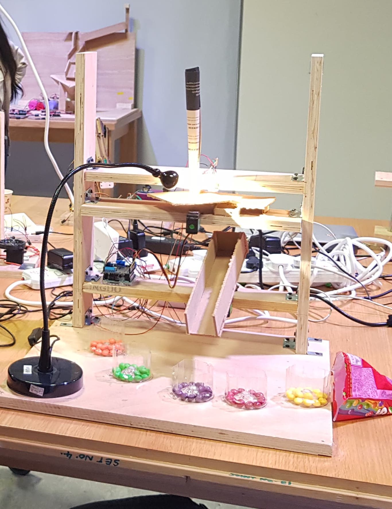
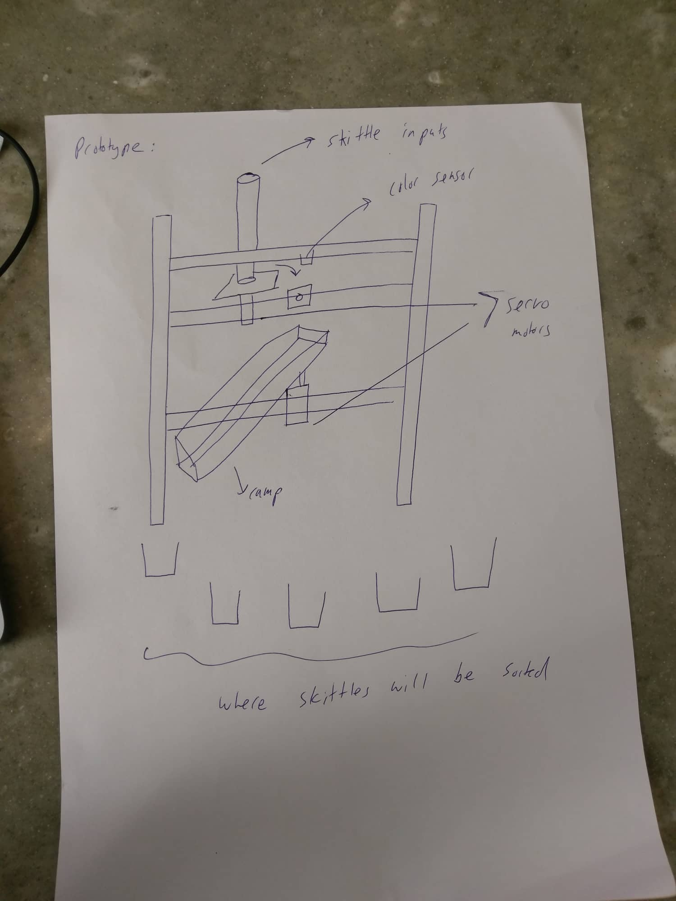
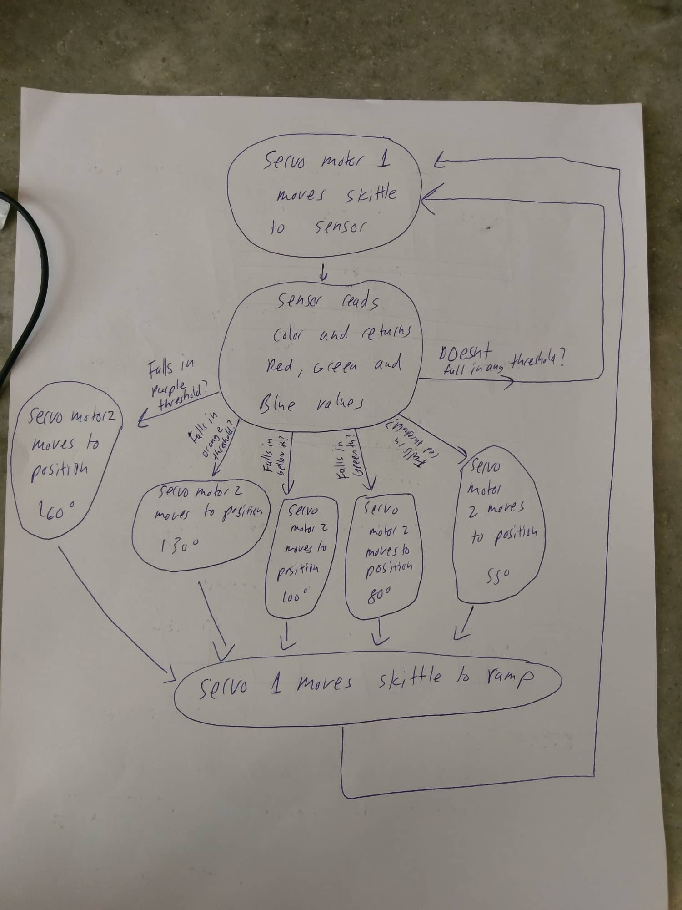

The Color Sorter!

The basic concept of my final project is that objects with color (in my case, skittles) are inputted into the machine, the machine detects the color of the object, and then it moves it to a box that is associated with its color. The machine involves the use of 2 servo motors, an Arduino Uno, an Adafruit motor shield, hardboard and wood.

Photos:

Prototype:

System Diagram:

