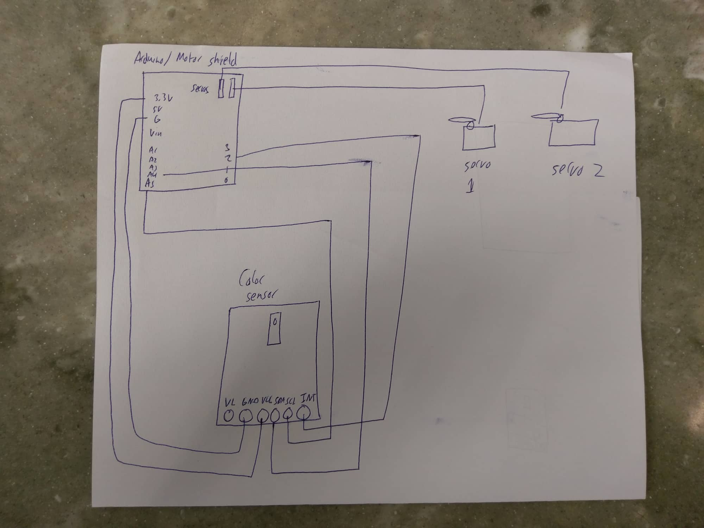

The Color Sorter!

The basic concept of my final project is that objects with color (in my case, skittles) are inputted into the machine, the machine detects the color of the object, and then it moves it to a box that is associated with its color. The machine involves the use of 2 servo motors, an Arduino Uno, an Adafruit motor shield, hardboard and wood.

Photos:

Prototype:

System Diagram:

Schematics:

Used Parts:

2 Servo Motors:

1 Arduino:

1 Adafruit Motor Sheild V2:

1 APDS-9960 RGB and Gesture Sensor:

Hardboard:

Wood:

Code:

How the Project Works:

First, skittles are put through the paper tube at the top of the machine. The servo motor on the top has a layer of hardboard attached to it that is thick enough to move a skittle but only allows one skittle to be moved. The servo motor receives a signal from the Arduino to move positions, which puts the skittle in front of the color sensor. Delays are used to keep the servo in place. The color sensor then reads the red, blue and green light of the skittle in front of it. This reading is sent to the Arduino. The Arduino then sees under which color threshold the readings fall, and then sends a signal to the second servo motor on the bottom to move to a position corresponding to the color of the skittle. The first servo motor then moves the skittle, which falls down a hole and onto the ramp which is connected to the second servo motor (the ramp is positioned to lead the skittle to the bottle that corresponds to its color). After that, the process is repeated. If there is no skittle or the reading does not fall under any of the defined thresholds for the colors, the first servo motor will move back to the position where it picks up skittles and then repeats the process.

How it was Made:

First the wooden frame was made. A large flat wooden base was used. 2 thin wooden pieces were measured and attached to the base with screws. Wooden levels were made by screwing wood pieces to the vertical wood pieces attached to the base. Then, the lower servo motor was attached to the bottom level. A hardboard ramp was made by cutting out pieces and super gluing them together. Hardboard was used because it is light enough to be moved around by the servo motor. After that, the position of the rotation of the ramp was played with to determine where to place the plastic bottles in which the skittles would fall. On the next level above, another servo motor was attached. On that level, a setup was created with hardboard and super glue. There was a hardboard base that had legs, and on top of that was another layer of hardboard (with a hole the size of a skittle that was attached to the servo motor) such that the two layers were in contact with each other. This allowed for one skittle to be moved without the rest following and falling when they come from the tube above: the hardboard was thick enough to move one skittle. At the edge of the lower layer of hardboard, there was a hole that went through the level of wood and towards the ramp. Next, on the highest wood level was a hole that had a paper tube in which skittles were placed. The tube led to the hardboard that moved the skittles. Also, on the highest level, a color sensor was attached such that when the servo motor moves the skittle, the skittle will be situated under the color sensor. A lamp was also used to illuminate the area where the color of the skittle was read. Finally, after everything was setup, the servos and color sensor were wired to the Arduino and Adafruit motor shield. The code was written (see above) and uploaded to the Arduino. To get the thresholds for the colors, each color of skittle was placed in front of the color sensor and the readings were recorded and put into the code.

Difficulties:

The main issue with this machine is that the values the color sensor reads for a certain color varies a lot depending on the light conditions of the room. So, every time the machine is set up in a new room with different light conditions, the values of the colors of the objects of interest have to be recorded, placed into the code, and then ran. A good solution to this would be to add a block of code that automatically records the values of the colors, creates thresholds for each color and places them into the desired IF statements.

