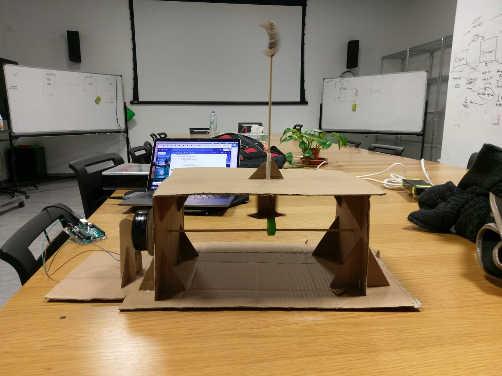

Machine Lab First Project!

This project was the first assignment for our class. It was a simple task; we were asked to use the mechanism of a lever to make an object move up and down.

Parts:

DC Motor-
Cardboard-
Bottle Cap-
Straw-
Thin Wooden Stick

How it Works:

As seen in the photo, the DC motor has a wheel attached to it that rotates when the power is on. As it rotates, it causes the thin wooden stick attached to it to rotate. Attached to that stick inside the box is a plastic bottle cap that is glued to the stick in a way such that the stick does not go through the middle but through the edge of the cap, so that when it rotates it lifts the piece of cardboard on top of it up and down. The cardboard on top of it has a thin wooden stick glued to it that runs through the top of the box and throw a straw that has low friction. On top of the stick is a moon shaped cardboard piece, which moves up and down due to the lever motion.

How it was built:

The set-up is mostly cardboard supported by hot glue. The base of the box is supported by hot glue and triangle cardboard cut outs. First, the main cardboard box was glued together. Then the thin wooden stick was put through the side, and the bottle cap was put through after. After that, a hole was made through the top of the cardboard box with a straw and another thin wooden stick from the top was placed through, glued to a cardboard base. Then, the moon shaped cardboard piece was carved out and placed onto the top of the stick. Finally, the DC motor was positioned such that the stick on the side was glued to the middle of the rotating wheel; it was supported with wooden sticks glued to the base. The motor was started by placing one wire in the 5V port in the port and the other wire in the ground.
